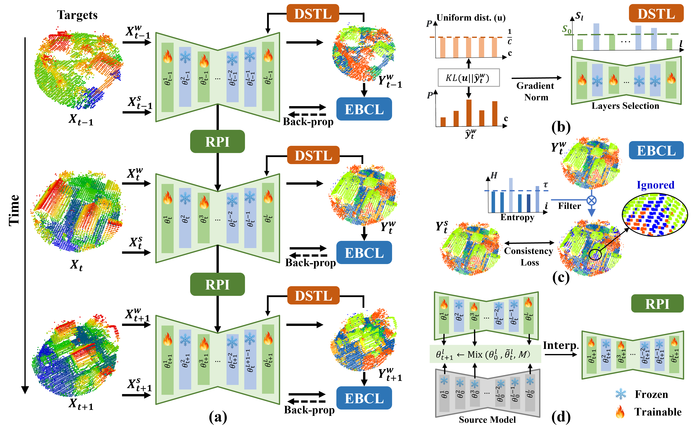

# APCoTTA: Continual Test-Time Adaptation for Semantic Segmentation of Airborne LiDAR Point Clouds

[](https://arxiv.org/abs/2505.09971v2) 
[](https://opensource.org/licenses/MIT)

This is the official PyTorch implementation of the paper **"APCoTTA: Continual Test-Time Adaptation for Semantic Segmentation of Airborne LiDAR Point Clouds"**.

**Authors:** Yuan Gao, Shaobo Xia*, Sheng Nie, Cheng Wang, Xiaohuan Xi, Bisheng Yang.

<p align="center">
   
</p>
Figure 1: Overview of the proposed APCoTTA framework.

---

## 📖 1. Introduction
Fixed models deployed in real-world scenarios often suffer from performance degradation due to continuous domain shifts. In this paper, we propose **APCoTTA**, a novel Continual Test-Time Adaptation (CTTA) framework tailored for Airborne Laser Scanning (ALS) point cloud semantic segmentation. 

---

## 📂 2. Repository Structure

- `Corruptions_Simulation/`: Scripts to generate the corrupted benchmark datasets (ISPRSC and H3DC).
- `APCoTTA/`: Core algorithm, pre-trained weights, and execution scripts.

---

## 🛠️ 3. Environment Setup

### 3.1 Clone the repository
```bash
git clone https://github.com/Gaoyuan2/APCoTTA.git
cd APCoTTA
```

### 3.2 Create a Conda environment
This code has been tested with PyTorch 1.8.2 on a single NVIDIA RTX 3090 GPU.
```bash
conda create -n apcotta python=3.7
conda activate apcotta
```

### 3.3 Install dependencies
```bash
# Install PyTorch 1.8.2 with CUDA 11.1
pip install torch==1.8.2 torchvision==0.9.2 torchaudio==0.8.2 --extra-index-url https://download.pytorch.org/whl/lts/1.8/cu111
# Install other requirements
pip install -r requirements.txt
```

---

### 3.4 Compile C++ Extensions
The KPConv backbone requires C++ extensions to be compiled before running. 

> **Important Note**: If you are unsure how to compile these extensions, please refer to the official **[KPConv-PyTorch Installation Guide](https://github.com/HuguesTHOMAS/KPConv-PyTorch/blob/master/INSTALL.md)** for detailed instructions.

Generally, you can compile them by running:
```bash
cd APCoTTA/utils/cpp_wrappers
sh compile_wrappers.sh
```
---

## 📊 4. Data Preparation (Generating ISPRSC & H3DC)

### 4.1 Download Original Datasets
Due to license restrictions, please download the raw data from official sites:
- [ISPRS Vaihingen 3D Dataset](https://www.isprs.org/resources/datasets/benchmarks/UrbanSemLab/3d-semantic-labeling.aspx)
- [Hessigheim 3D (H3D) Dataset](https://ifpwww.ifp.uni-stuttgart.de/benchmark/hessigheim/default.aspx)

### 4.2 Generate Corrupted Data
Navigate to the generation folder. Please ensure you select the **H3D Validation Set** and the **ISPRS Test Set** as inputs to generate the corrupted benchmarks:

```bash
cd Corruptions_Simulation
# Generate H3DC
python rainSimulation_H3D.py
# Generate ISPRSC
python rainSimulation_ISPRS.py
```

### 4.3 Organize Data Folder
Create a `data` directory inside `APCoTTA` and move your generated datasets there:
```bash
cd ../APCoTTA
mkdir data
# Move your generated ISPRSC and H3DC folders here
```

---

## 💾 5. Pre-trained Weights

We provide pre-trained source models via Baidu Netdisk.

### 5.1 Download
- **Link**: [APCoTTA_PretrainedWeight 链接: https://pan.baidu.com/s/1m9NBwqP1nnNX-S-hu_5ZcA?pwd=5xqd 提取码: 5xqd] 

### 5.2 Storage Path
Download and place the `results` folder into the `APCoTTA` folder:
`APCoTTA/results/`

---

## 🚀 6. Running the Code (Reproducing Results)

Navigate to the core code directory:
```bash
cd APCoTTA
```

### 6.1 Run on ISPRSC Benchmark
```bash
python run_APCoTTA_ISPRSC.py
```

### 6.2 Run on H3DC Benchmark
```bash
python run_APCoTTA_H3DC.py
```

---

## 🏆 7. Main Results (Severity Level 5)

| Task                | mIoU (%)  | Mean OA (%) |
| :------------------ | :-------: | :---------: |
| **ISPRS to ISPRSC** | **49.74** | **77.43**   |
| **H3D to H3DC**     | **46.22** | **77.25**   |

---

## 📖 8. Citation
```bibtex
@misc{gao2026apcottacontinualtesttimeadaptation,
      title={APCoTTA: Continual Test-Time Adaptation for Semantic Segmentation of Airborne LiDAR Point Clouds}, 
      author={Yuan Gao and Shaobo Xia and Sheng Nie and Cheng Wang and Xiaohuan Xi and Bisheng Yang},
      year={2026},
      eprint={2505.09971},
      archivePrefix={arXiv},
      primaryClass={cs.CV},
      url={https://arxiv.org/abs/2505.09971}, 
}
```

---

## 🙏 9. Acknowledgements

We sincerely thank the authors of the following open-source repositories for their excellent work:

- **[KPConv-PyTorch](https://github.com/HuguesTHOMAS/KPConv-PyTorch)**: For the powerful point cloud segmentation backbone.
- **[CoTTA](https://github.com/qinenergy/cotta)**: For the pioneering continual test-time adaptation framework.
- **[PALM](https://github.com/sarthaxxxxx/PALM)**: For their effective adaptive learning rate mechanisms in CTTA.
- **[3D_Corruptions_AD](https://github.com/thu-ml/3D_Corruptions_AD)**: For their excellent code base used for simulating 3D corruptions and benchmarks.


---

## 📜 10. License
This project is licensed under the MIT License.
```

祝你的开源工作顺利，收获满满的 Star！
